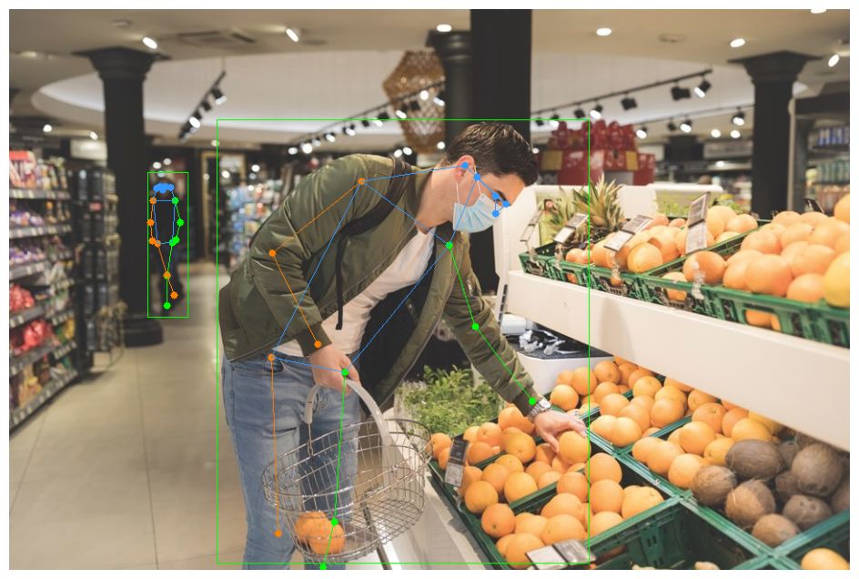
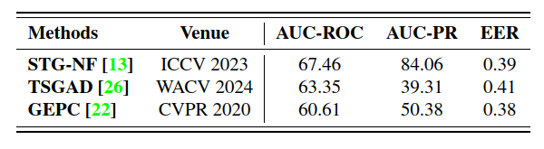
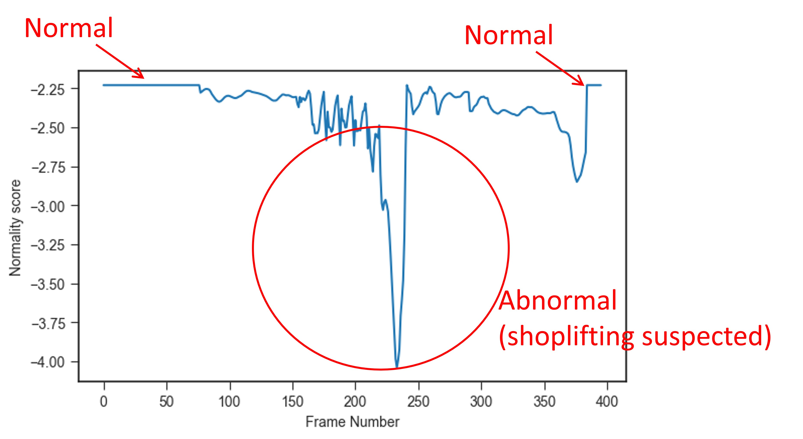
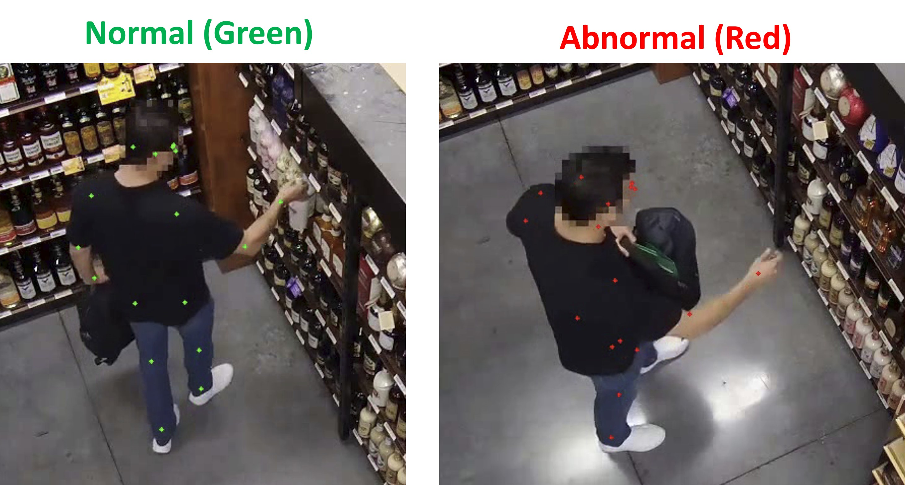
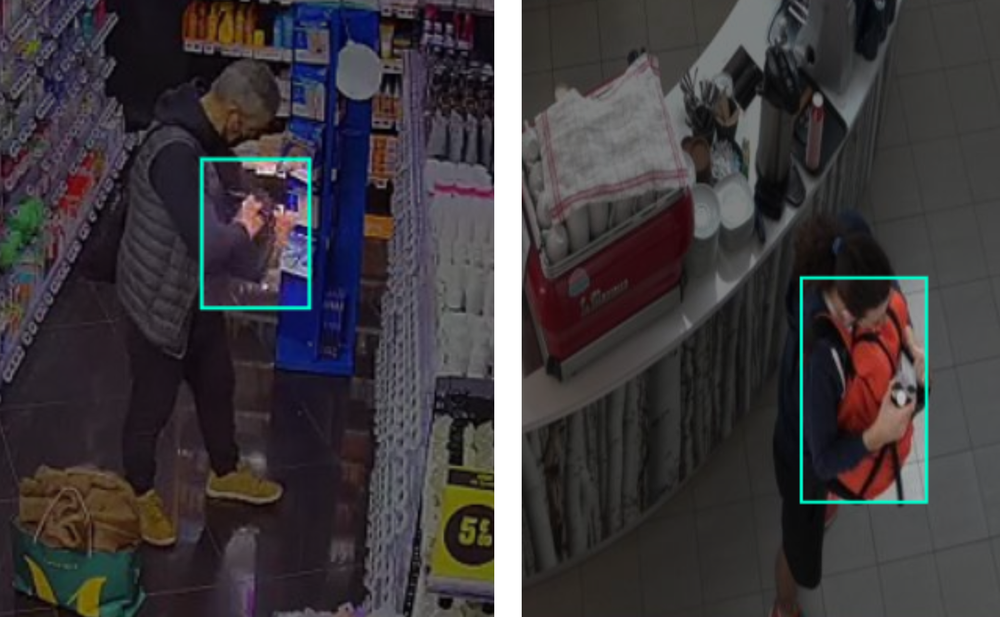

# Shoplifting Video Detection

This project aims at identifying the suspected shoplifting behaviour in videos using human pose estimation and classification of the sequences of detected keypoints. Hand pose estimation could also a possible solution but is not chosen because (1) the hand pose is more complex and more sensitive to occlusions and noises, especially in low quality video, (2) the shoplifting behaviour should be apparent from the larger scale movement and most importantly (3) I can only find useful pose data / pretrained model for classifying shoplifting behaviour within the constained time. It was done in a 5-day period on a part-time basis (~30 hours spent in total) mainly to explore the ideas. The codes are not optimized for real-time inference and are just for demo purpose, but the conversion to real-time inference is surely possible. The structure of this project is consisted of two stages.

- (I) Human Pose Estimation: Object Detection with Tracking (YOLO) -> Pose Estimation (ViTPose) -> Smoothening of Keypoints (SmoothNet)

- (II) Human Pose Anomaly Detection for Shoplifting Behaviour: Keypoint Classification (STG-NF)

## Usage

### Directory Structure
```
.
├── mmcv-1.3.9
├── ViTPose
├── SmoothNet
├── STG_NF
│  
├── weights   # store pretrained/ trained model weights for different models
│  
├── videoclips   # example videos to be examined and processed by the models
│   └──{videoname}.mp4
│  
├── video_output   # store outputs from models
│   ├── {videoname}   # directory storing inferred keypoint json files for the STG-NF model
│   │   └── e.g. 07_0500_alphapose_tracked+person.json # in the format of {VideoIndex}_{PersonID}_alphapose_tracked+person.json
│   ├── {videoname}_track.mp4   # output video with keypoints annotated (each PersonID has its own color to show tracking)
│   ├── {videoname}.npz   # storing the keypoints inferred from ViTPose and smoothened by SmoothNet
│   ├── {videoname}_anomaly_det.mp4   # output video with keypoints in red showing suspicious behaviour and in green for normal pose
│   └── STG_NF_predicted_csv # directory storing STG-NF model prediction (normal/abnormal) in csv files
│       └── e.g. 07_0500_alphapose_tracked+person.csv
│  
├── pose_est_video_tracking.ipynb   # main inference code for Stage 1 (Human Pose Estimation)
└── keypts_anomaly_detection.ipynb   # main inference code for Stage 2 (uman Pose Anomaly Detection)

```

After setting up the environment as follows, you can run the `pose_est_video_tracking.ipynb` for the Stage 1 inference and `keypts_anomaly_detection.ipynb` for the Stage 2 inferece. 

`pose_est_video_tracking.ipynb` takes video from the `videoclips` directory and outputs video with keypoints annotated as `{videoname}_track.mp4` in the video_output directory (as well as other .npz and .json files needed for the STG-NF model inference in stage 2). Then running `keypts_anomaly_detection.ipynb` will give you `{videoname}_anomaly_det.mp4` showing normal/abnormal pose classification in the `video_output` directory as described in the above directory structure. 

### Enviornment Set-Up

```bash
# Conda Environment Setup (more recommended)
conda env create -f environment.yml

#OR by pip
pip install -r requirements.txt
```

Then install mmcv and ViTPose by:
```bash

cd mmcv-1.3.9
pip install -e .

cd ..

cd ViTPose
pip install -v -e .
```

Next download all the model weight files into the `weights` directory
[download link] (https://drive.google.com/drive/folders/1ipuCLbE4eDiuidWdFWctRBolDSHcKKQ0?usp=sharing)

The video_clips can be downloaded from [here] (https://drive.google.com/drive/folders/1Cn5SierV-_1-0mRF8OSO79kWicbCTXyK?usp=sharing)

The video_output content I got from my inference can be downloaded [here] (https://drive.google.com/drive/folders/1b0zsRei1cMxyri-Oyk-69YHy5Os6h0y4?usp=sharing)

## Project Description and Results Demo

## Stage 1: Pose Estimation

### (i) Human detection and Pose Estimation



For the limited time constrained, the relatively reliable and easy-to-setup YOLOv11 model is used for object detection (human detection) and ViTPose model is used for pose estimation. Other more efficient models can definitely be explored for these purposes. The convention of full body COCO17 format is adapted in pose estimation because the STG-NF requires inputs in this format. 

### (ii) Smoothening the keypoint detection 


Since keypoint detection is done on individual frames separately, there is instability of keypoints detected between frames resulting in jittering problems of keypoints in videos. Some frames even have missed keypoints for the person seen in the video, due to occlusion or inherent model capability. A research into these problems lead me to the paper of [SmoothNet] (https://ailingzeng.site/smoothnet) . According to them, SmoothNet has better performance than any existing traditional filters and it is ultralight and cost minimal overhead in inference. The performance of SmoothNet is demonstrated in the above animation. They can smoothen keypoint predictions, reduce jittering as well as recovering some missed keypoints in between frames. With better postprocessing filtering technique like SmoothNet, we can lower the requirment for pose estimation and use lighter pose estimation model to reduce the inference overhead. 

### (iii) Tracking


Tracking is enabled by the ByteTrack algorithm with YOLOv11 so that we can gather the sequences of keypoints belonging to the same person. In the animation above, tracking is shown by different colors of the keypoints for each person. 

## Stage 2: Human Pose Anomaly Detection for Shoplifting

To determine if the detected keypoints are suspicious or not, we need to have the knowledge of what the shoplifting keypoints are like and what the normal shopping behaviour is like. We need to have some labelled data / a pretrained model for that in order to learn this. The best dataset I managed to find and organize for model use within the time constraint is [PoseLift] (https://github.com/TeCSAR-UNCC/PoseLift). It has labels for sequences of keypoints for shoplifting and normal shopping behaviour extracted from actual videos. 



According to the paper of PoseLift, the model that has the best performance is [STG-NF] (https://github.com/orhir/STG-NF). Therefore I chose this model for the use of this project. I trained the STG-NF model myself and obtained the result on the PoseLift dataset as they claimed on the paper. Basically, as shown in the graph below for the person in the `shoplifting1.MP4` video, the STG-NF model gives a 'normality' score to the pose in the frame.



When the normality score is lower than certain threshold value, the person can thought of being suspected of some shoplifting behaviour, as demonstrated in the middle part of the graph indicated by the big circle. 



In the output video, I painted keypoints with the normal pose in green and that with the abnormal (shoplifting) pose in red. Please note that although STG-NF is already the best model on the PoseLift dataset, its AUCP-ROC score for identifying abnormal pose is only around 70. Also, it is trained on normal dataset and it identify abnormal activity when in inference by recognizing pose different from the normal pose that it learned. Added to that, The PoseLift dataset only has 43 videos that has shoplifting involved and 112 videos with normal behaviour throughout. The small data amount limits the performance of the model. In addition, the height/ angle of surveillance camera can affect the model performance a lot, especially when they are quite different from what is in the test dataset. From those {videoname}_anomaly_det.mp4, we can see that there is plenty missed or false-detected shoplifting behaviour. The main spirit here is just illustrate the ideas to tackle the problem. The model performance can surely be greatly improved if it is trained on more diverse data. 

## Improvements

- Collect more pose data for shoplifting behaviour (more diverse behaviour, more different camera angle/ distance,  etc.) to make the Human Pose Anomaly model more robust

- More systemtically adjust the threshold for abnormal detection

- Can research on other time sequential model for abnormal pose detection

- Should definitely get to train the Human Pose Anomaly model on both normal and shoplifting / other crminal motion data, instead of purely on normal data. It is important to note that what is different from the 'normal' action you have seen might not necessarily be criminal. It would be irritating to the users if false detection happens too frequently. 

- Optimize the code for real-time use (Also can use lighter model for human detection and pose estimation)

- Apart from identifying shoplifting by looking at the keypoints from pose estimation, we should do a systemtical comparison with the much simpler image detection approach. The advatnage of an image detection is that it can see the surrouding objects apart from the pose or hand pose. For example, the pose of a customer putting an item into the shopping basket could probably be very similar to the scenario that he/ she is putting the item into his/ her bag, but one is legal and the other is illegal. Like what the following two images show, with the image detection, we can more clearly see that the customers are putting the items into a bag but not the basket from the supermarket. More data like these can be found on datasets on [roboflow] (https://universe.roboflow.com/rehabcv-a1agb/shoplifting-2). 



There is also model of this kind work for behaviour classification in video like [SlowFast] (https://github.com/facebookresearch/SlowFast). We should have a comparison of the pose model and the image detection model on these tasks. If the simpler image detection works similarly well, we could save a lot of efforts in collecting data because image/ video data without keypoint is much more readily avaiable / can much more easily collected. 
